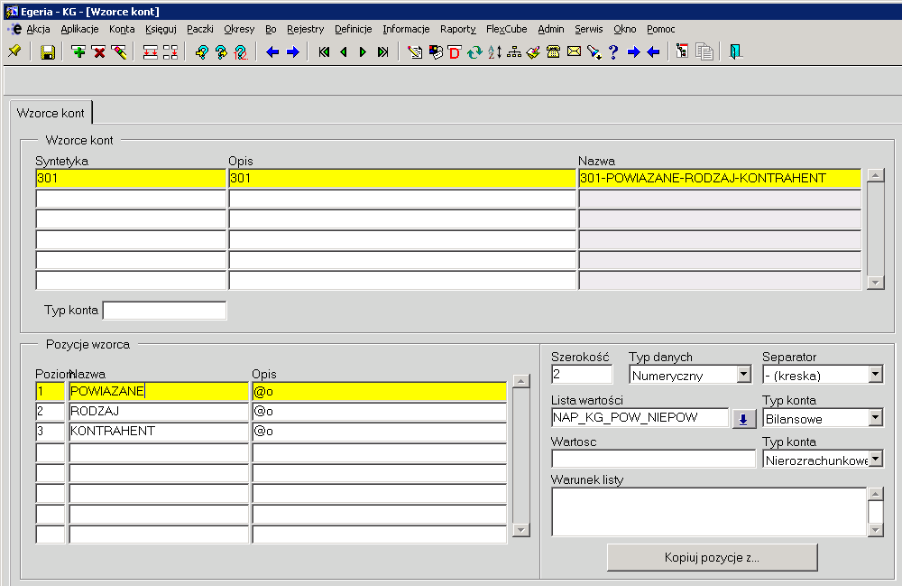

Do zmiany:

Egeria:
- Środki trwałe
- Wyciągi bankowe (131 rachunki bankowe, 149 śrdoki w drodze)
- Raporty kasowe (100, 148 środki w dordze kasy )

i.naprzod:
- książka sekretariatu (kod na front backend i w pakiecie oracle)
- pakiet naprzod2.napwf_fin_zobowiazania (761)

- refaktury  
- dekretacja SOD (761-01-11) - grupa, po za? > ma być 761-01-0-11-000000 -- jaki kontrahent? 

- Spółki cywilne (egadm1.nap_sc_pk)
- PKPZ, zaciąganie danych z MAPI (naprzod2.nap_mapi_tools.dodajDekretyDoPK) 314 / 301

- FZP faktury paliwowe (761-02-99 - pozostałe koszty operacyjne) będzie: 761-02-0-99
- FZT fakutury za telefon (761)

- faktury należnościowe (702 - konta przychodowe) > automat backenf 
- pakiet dla wgrywanych z i.naprzod: nap_mkt_procesy.WGRAJ_FAKTURE_DLA_SK >> dekretacja idzie z EGE dla FVCU (Catering)

- PZ i automaty do rozksięgowania 

- PK - rezerwy urlopowe (301 rozliczenie zakupów poza grupą) > jak oznaczyć powiązane, niepowiązane? 
- PK - rezerwy PZtów

DONE:
Wzorzec na 301:

